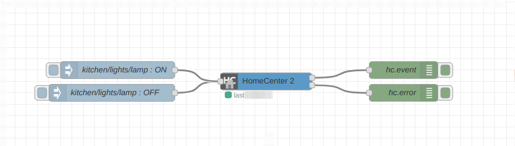

# A bridge between Fibaro HomeCenter 2 and NodeRed

The node connects to a HomeCenter and listens for device property changes, gives devices  friendly identifiers (e.g. `living-room/light/lamp`) and emit output node-red events.
The node also consumes input events and calls HomeCenter actions based on given input events. 

## Flow example


```json
[{"id":"81e3d6d5.cf8668","type":"home-center","z":"dfb9ceb.40e533","name":"HomeCenter 2","device":"","x":460,"y":100,"wires":[["6375721b.5dd3bc"],["54ad8d6d.220454"]]},{"id":"6375721b.5dd3bc","type":"debug","z":"dfb9ceb.40e533","name":"hc.event","active":true,"tosidebar":true,"console":false,"tostatus":false,"complete":"true","targetType":"full","x":700,"y":80,"wires":[]},{"id":"54ad8d6d.220454","type":"debug","z":"dfb9ceb.40e533","name":"hc.error","active":true,"tosidebar":true,"console":false,"tostatus":false,"complete":"true","targetType":"full","x":700,"y":120,"wires":[]},{"id":"6dbacab5.56a1a4","type":"inject","z":"dfb9ceb.40e533","name":"kitchen/lights/lamp : OFF","topic":"kitchen/lights/lamp","payload":"false","payloadType":"bool","repeat":"","crontab":"","once":false,"onceDelay":0.1,"x":190,"y":120,"wires":[["81e3d6d5.cf8668"]]},{"id":"5de166ca.8e9998","type":"inject","z":"dfb9ceb.40e533","name":"kitchen/lights/lamp : ON","topic":"kitchen/lights/lamp","payload":"true","payloadType":"bool","repeat":"","crontab":"","once":false,"onceDelay":0.1,"x":200,"y":80,"wires":[["81e3d6d5.cf8668"]]}]
```

## Output event examples

Light has turned on:
```json
{
    "topic": "garage/light/lamp",
    "id": 10,
    "property": "value",
    "payload": true,
    "previous": false
}
```

Temperature has changed:
```json
{
    "topic": "living-room/climate/temperature",
    "id": 20,
    "property": "value",
    "payload": 22.7,
    "previous": 22.9
}
```

Device power consumption has changed:
```json
{
    "topic": "living-room/climate/fan",
    "id": 30,
    "property": "power",
    "payload": 2.9,
    "previous": 2.7
}
```

## Input event examples

Event message format:
```
{
    "topic": "device literal identifier",
    "payload": {
        "action1": [],
        "action2": [argument1],
        "action3": [argument1, argument2, ...]
    }
}
```

 Turn on a light:
```json
{
    "topic": "garage/light/lamp",
    "payload": {
        "turnOn": []
    }
}
```

Change RGB/W device color:
```json
{
    "topic": "living-room/light/led-strip",
    "payload": {
        "setColor": [255, 0, 0, 0]
    }
}
```

### Input message shortcuts
`payload` can be a boolean value, in this case it will be transformed into `turnOn` and `turnOff` actions.

A shortcut version of turning on a light (in case when a device has `turnOn` and `turnOff` actions), `true` calls `turnOn` and `false` calls `turnOff` action accordingly:

```json
{
    "topic": "garage/light/lamp",
    "payload": true
}
```
In the case when `payload` is nether object nor boolean it will be transformed into `setValue` action. 

A shortcut version of setting a brightness of an RGB/W or a dimmer device (in case when a device has `setValue` action):

```json
{
    "topic": "living-room/light/led-strip",
    "payload": 50
}
```

In the case when an action has only one argument it can be passed without wrapping it into an array:
```json
{
    "topic": "living-room/climate/thermostat",
    "payload": {
        "setFanMode": 2    
    } 
}
```
instead of:
```json
{
    "topic": "living-room/climate/thermostat",
    "payload": {
        "setFanMode": [2]    
    } 
}
```

## Errors handling
The second output allows handling error responses from HomeCenter and the node.

## Introspecting
The information for introspecting the devices friendly names and all possible actions is available on the node context.
1) Navigate to `Context Data`
2) Select a HomeCenter node
3) Click on `Refresh` 
4) Devices and their available actions grouped by rooms and categories can be introspected on the node context: 
